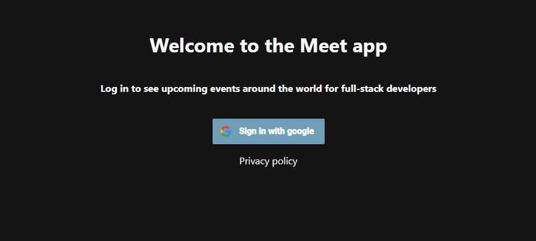

A link to the app can be found [here](https://rswager83.github.io/meet_/).

## Objective: 
To build a serverless, progressive web application (PWA) with React using a
test-driven development (TDD) technique. The application uses the Google
Calendar API to fetch upcoming events.

## Built and Tested with:
- Amazon Web Services (AWS)
- Google Cloud Platform
- JavaScript
- React
- Puppeteer
- Jest
- Enzyme
- Recharts

## User Stories:

* As a user, I should be able to see events occurring in whatever city I choose. So that I know what my options are.<br>
* As a user, I should be able to view the events or hide them. So that I can easily scan through the options that are available in the city.<br>
* As a user, I should be able to choose how many events are listed. So that I know how many events are taking place.
* As a user, I should be able to use my app offline.So that I can still use my app without internet.
* As a user, I should be able to see a chart or list of events taking place. So that I can easily sort through my options.

## Test Scenarios:

### Filter Events by City

**Scenario 1:** When the user hasn’t searched for a city, show upcoming events from all cities. 
```
Given: user hasn’t searched for any city
When: the user opens the app
Then: the user should see the list of upcoming events
```
**Scenario 2:** The user should see a list of suggestions when they search for a city. 
```
Given: the main page is open
When: user starts typing in the city textbox
Then: the user should receive a list of cities (suggestions) that match what they’ve typed
```
**Scenario 3:** The user can select a city from the suggested list. 
```
Given: the user was typing “Berlin” in the city textbox
When: the user selects a city (e.g., "Berlin, Germany") from the list
Then: their city should be changed to that city (i.e., “Berlin, Germany”) 
And: the user should receive a list of upcoming events in that city
```
### Show/Hide Details of an Event

**Scenario 1:**  An event element is collapsed by default.
```
Given: that the user opens the main page
When: the user views the event element of a city
Then: the event element from each city will initially be collapsed/hidden from the user
```
**Scenario 2:** The user can expand an event to see its details. 
```
Given: the user is viewing a specific event
When: the user selects the event 
Then: the details of that event will be listed for the user to view
```
**Scenario 3:** The user can collapse an event to hide its details. 
```
Given: the event element is opened
When: the user closes the event element
Then: the details are hidden
```
### Specify Number of Events

**Scenario 1:** When the user hasn’t specified a number, 32 is the default number.
```
Given: the user at the home page
When: the user chooses no specific amount of search results
Then: the default amount of visible search results per city will be 32
``` 
**Scenario 2:** The user can change the number of events they want to see. 
```
Given: the user opened the search results query
When: the user changes the default number
Then: the default number of results will be changed to what the users select
```
### Use the App when Offline

**Scenario 1:** Show cached data when there’s no internet connection. 
```
Given: the app has no internet connection
When: the data is cached
Then: that data will be shown
```
**Scenario 2:** Show error when user changes the settings (city, time range). 
```
Given: the user opened the settings tab
When: the user changes the settings 
Then: an error will show
```
### Data Visualisation

**Scenario 1:** Show a chart with the number of upcoming events in each city. 
```
Given: the user selected a city
When: the user clicks on the city’s upcoming events button
Then: a chart will list the upcoming events taking place in the city
```

## Contact:
Please feel free to contact me at nanswaglen83@gmail.com


